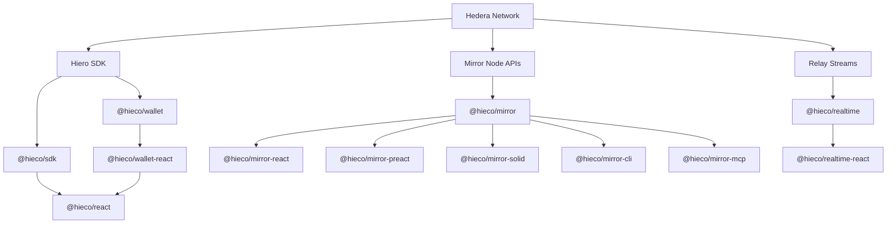

# Hieco

Hieco is a TypeScript-first toolkit for building applications on Hedera.

It gives you higher-level SDKs for the parts of the stack most application developers actually touch:

- wallet connection
- Hedera queries and transactions
- Mirror Node reads
- realtime relay streams
- terminal tooling
- MCP tooling for AI agents

The goal is simple: make Hedera development feel like normal modern application development, with clear runtime boundaries, strong typing, and framework-friendly APIs.

## What Hieco Is

Hieco is not a new blockchain and it is not a replacement for the official Hedera developer stack.

It sits one layer above the underlying Hedera ecosystem:

- **Hedera** is the public network
- **Hiero** is the open-source SDK and infrastructure stack around that network
- **Hieco** is the developer-facing toolkit that makes those lower-level surfaces easier to use in real applications

In practical terms:

- Hieco builds on top of the [Hiero SDK](https://www.npmjs.com/package/@hiero-ledger/sdk) for transaction-focused packages such as [`@hieco/sdk`](./packages/sdk/README.md), [`@hieco/react`](./packages/react/README.md), [`@hieco/wallet`](./packages/wallet/README.md), and [`@hieco/wallet-react`](./packages/wallet-react/README.md)
- Hieco talks directly to network-facing services for Mirror and relay packages such as [`@hieco/mirror`](./packages/mirror/README.md) and [`@hieco/realtime`](./packages/realtime/README.md)

## What Hedera Is

[Hedera](https://hedera.com) is a public distributed ledger network used for:

- accounts and payments
- token creation and token transfers
- smart contracts
- consensus and messaging
- application backends that need a public, verifiable network layer

If you are building an app that needs to read Hedera data, submit transactions, connect a wallet, or listen to live blockchain activity, Hedera is the network underneath that work.

## What Hiero Is

[Hiero](https://hiero.org) is the open-source technology stack and SDK ecosystem used around Hedera.

For Hieco users, the important part is:

- Hiero provides the official lower-level SDK foundation
- Hieco uses that foundation where direct signer access and transaction execution are needed
- Hieco then adds a more application-friendly API on top

## Start Here

Choose the package family that matches what you are building:

| If you want to build...                              | Start with                                                                                                                                                                              | Why                                                                            |
| ---------------------------------------------------- | --------------------------------------------------------------------------------------------------------------------------------------------------------------------------------------- | ------------------------------------------------------------------------------ |
| A React app that needs wallet connection             | [`@hieco/wallet-react`](./packages/wallet-react/README.md)                                                                                                                              | It gives you the provider, low-level hooks, and a dialog-friendly wallet hook. |
| A React app that needs Hedera queries or mutations   | [`@hieco/react`](./packages/react/README.md)                                                                                                                                            | It wraps `@hieco/sdk` with TanStack Query hooks.                               |
| Server code, scripts, workers, or backend handlers   | [`@hieco/sdk`](./packages/sdk/README.md)                                                                                                                                                | It is the core Hedera client for reads, transactions, and signer-scoped usage. |
| Read-only blockchain data from Mirror Node           | [`@hieco/mirror`](./packages/mirror/README.md)                                                                                                                                          | It gives you a typed client for Mirror Node APIs.                              |
| Read-only Mirror data inside React, Preact, or Solid | [`@hieco/mirror-react`](./packages/mirror-react/README.md), [`@hieco/mirror-preact`](./packages/mirror-preact/README.md), or [`@hieco/mirror-solid`](./packages/mirror-solid/README.md) | These packages add framework-native query bindings on top of `@hieco/mirror`.  |
| Live relay streams and subscriptions                 | [`@hieco/realtime`](./packages/realtime/README.md) or [`@hieco/realtime-react`](./packages/realtime-react/README.md)                                                                    | These packages handle Hedera relay WebSocket and JSON-RPC stream flows.        |
| Terminal access to Mirror Node data                  | [`@hieco/mirror-cli`](./packages/mirror-cli/README.md)                                                                                                                                  | It gives you a `hieco` CLI for read-only inspection and scripting.             |
| Mirror Node data for AI agents through MCP           | [`@hieco/mirror-mcp`](./packages/mirror-mcp/README.md)                                                                                                                                  | It exposes Mirror data through an MCP server.                                  |

## Quick Start

### React App With Wallet And Hedera Hooks

This is the main client-side path for most new applications.

```bash
bun add @hieco/wallet @hieco/wallet-react @hieco/react @hieco/sdk @tanstack/react-query
```

```tsx
"use client";

import type { ReactNode } from "react";
import { WalletProvider, useWalletSigner } from "@hieco/wallet-react";
import { WalletButton, WalletDialog } from "@hieco/wallet-react/ui";
import { HiecoProvider, useAccountInfo } from "@hieco/react";

function HiecoLayer({ children }: { children: ReactNode }) {
  const signer = useWalletSigner();

  return (
    <HiecoProvider config={{ network: "testnet" }} signer={signer}>
      {children}
    </HiecoProvider>
  );
}

function AccountCard() {
  const account = useAccountInfo({ accountId: "0.0.1001" });

  if (account.isPending) return <div>Loading...</div>;
  if (account.isError) return <div>{account.error.message}</div>;

  return <pre>{JSON.stringify(account.data, null, 2)}</pre>;
}

export function App() {
  return (
    <WalletProvider projectId="YOUR_WALLETCONNECT_PROJECT_ID">
      <WalletButton />
      <WalletDialog />
      <HiecoLayer>
        <AccountCard />
      </HiecoLayer>
    </WalletProvider>
  );
}
```

Use this when you want:

- wallet connection
- a browser signer
- Hedera queries and mutations inside React

### Server Runtime With The Core SDK

Use this when you are building backend code, scripts, jobs, or route handlers.

```bash
bun add @hieco/sdk
```

```ts
import { hieco } from "@hieco/sdk";

const client = hieco.fromEnv();

const account = await client.account.info("0.0.1001").now();

if (account.ok) {
  console.log(account.value.accountId);
}
```

`hieco.fromEnv()` is a server-side convenience. It loads operator credentials and network config from environment variables.

### Read-Only Mirror Node Access

Use this when you only need blockchain data and do not need transaction execution.

```bash
bun add @hieco/mirror
```

```ts
import { MirrorNodeClient } from "@hieco/mirror";

const mirror = new MirrorNodeClient({ network: "testnet" });

const account = await mirror.account.getInfo("0.0.1001");
const transactions = await mirror.transaction.listPaginated({
  limit: 10,
  order: "desc",
});
```

## Core Concepts

### Wallet Layer vs Application Layer

Hieco separates wallet connection from Hedera application logic.

- Use [`@hieco/wallet`](./packages/wallet/README.md) or [`@hieco/wallet-react`](./packages/wallet-react/README.md) to connect a wallet and obtain a signer
- Use [`@hieco/sdk`](./packages/sdk/README.md) or [`@hieco/react`](./packages/react/README.md) to read data, build transactions, and submit them

That separation keeps wallet state simple and makes the SDK easier to reuse across environments.

### Hiero-Based Packages vs Network-Based Packages

Hieco has two main families:

- **Hiero-based application packages**
  - [`@hieco/sdk`](./packages/sdk/README.md)
  - [`@hieco/react`](./packages/react/README.md)
  - [`@hieco/wallet`](./packages/wallet/README.md)
  - [`@hieco/wallet-react`](./packages/wallet-react/README.md)
- **Network-facing service packages**
  - [`@hieco/mirror`](./packages/mirror/README.md) and its framework wrappers
  - [`@hieco/realtime`](./packages/realtime/README.md) and [`@hieco/realtime-react`](./packages/realtime-react/README.md)
  - [`@hieco/mirror-cli`](./packages/mirror-cli/README.md)
  - [`@hieco/mirror-mcp`](./packages/mirror-mcp/README.md)

### Browser vs Server

Different Hieco packages are designed for different runtimes:

- [`@hieco/sdk`](./packages/sdk/README.md) works well in server code and signer-scoped browser code
- [`@hieco/react`](./packages/react/README.md) is the React data layer
- [`@hieco/wallet`](./packages/wallet/README.md) and [`@hieco/wallet-react`](./packages/wallet-react/README.md) are browser-oriented for real wallet connection flows
- Mirror and realtime packages can be used outside a UI framework as normal clients

### Current Wallet UX

The current Hieco wallet flow is designed around practical web usage:

- desktop web opens the wallet dialog first
- installed extensions are preferred when they exist
- the same dialog can expose QR and extension actions from one shared attempt
- mobile flows are wallet-handoff oriented

To actually connect a wallet, you should pass a real WalletConnect `projectId`.

## Package Map

### Application SDK

| Package                                      | Purpose                                                                            |
| -------------------------------------------- | ---------------------------------------------------------------------------------- |
| [`@hieco/sdk`](./packages/sdk/README.md)     | Core Hedera SDK for queries, transactions, signer-scoped clients, and server usage |
| [`@hieco/react`](./packages/react/README.md) | React wrapper around `@hieco/sdk` with TanStack Query                              |

### Wallet SDK

| Package                                                    | Purpose                                       |
| ---------------------------------------------------------- | --------------------------------------------- |
| [`@hieco/wallet`](./packages/wallet/README.md)             | Headless wallet runtime                       |
| [`@hieco/wallet-react`](./packages/wallet-react/README.md) | React provider, hooks, and optional wallet UI |

### Mirror SDK

| Package                                                      | Purpose                            |
| ------------------------------------------------------------ | ---------------------------------- |
| [`@hieco/mirror`](./packages/mirror/README.md)               | Typed Mirror Node client           |
| [`@hieco/mirror-react`](./packages/mirror-react/README.md)   | React bindings for Mirror queries  |
| [`@hieco/mirror-preact`](./packages/mirror-preact/README.md) | Preact bindings for Mirror queries |
| [`@hieco/mirror-solid`](./packages/mirror-solid/README.md)   | Solid bindings for Mirror queries  |
| [`@hieco/mirror-cli`](./packages/mirror-cli/README.md)       | CLI for Mirror Node data           |
| [`@hieco/mirror-mcp`](./packages/mirror-mcp/README.md)       | MCP server for Mirror Node data    |

### Realtime SDK

| Package                                                        | Purpose                                   |
| -------------------------------------------------------------- | ----------------------------------------- |
| [`@hieco/realtime`](./packages/realtime/README.md)             | Realtime client for Hedera relay streams  |
| [`@hieco/realtime-react`](./packages/realtime-react/README.md) | React bindings for realtime relay streams |

## Architecture



## MCP Server

Hieco includes an MCP server for Mirror Node data:

- [`@hieco/mirror-mcp`](./packages/mirror-mcp/README.md)

Use it when you want an AI agent or MCP-compatible tool to read:

- accounts
- tokens
- transactions
- contracts
- topics
- blocks
- network information

## Agent Skills

Hieco also ships agent skills for the public package families:

- Hieco SDK
- Hieco Wallet
- Hieco Mirror
- Hieco Realtime
- Hieco Mirror CLI

Install the skill collection with [flins](https://flins.tech/):

```bash
npx flins add powxenv/hieco
```

```bash
bunx flins add powxenv/hieco
```

Useful links:

- [flins website](https://flins.tech/)
- [flins GitHub repository](https://github.com/flinstech/flins)

## Documentation

If you are new to the ecosystem, this reading order works well:

1. [`@hieco/wallet-react`](./packages/wallet-react/README.md)
2. [`@hieco/react`](./packages/react/README.md)
3. [`@hieco/sdk`](./packages/sdk/README.md)

Other package guides:

- [`@hieco/wallet`](./packages/wallet/README.md)
- [`@hieco/mirror`](./packages/mirror/README.md)
- [`@hieco/mirror-react`](./packages/mirror-react/README.md)
- [`@hieco/mirror-preact`](./packages/mirror-preact/README.md)
- [`@hieco/mirror-solid`](./packages/mirror-solid/README.md)
- [`@hieco/mirror-cli`](./packages/mirror-cli/README.md)
- [`@hieco/mirror-mcp`](./packages/mirror-mcp/README.md)
- [`@hieco/realtime`](./packages/realtime/README.md)
- [`@hieco/realtime-react`](./packages/realtime-react/README.md)

## Repository Development

Install workspace dependencies:

```bash
bun install
```

Run the quality checks:

```bash
bun run lint && bun run typecheck && bun run fmt
```

Build the packages:

```bash
bun run build
```

See [CONTRIBUTING.md](./CONTRIBUTING.md) for repository workflows.

## Links

- GitHub: [powxenv/hieco](https://github.com/powxenv/hieco)
- Issues: [github.com/powxenv/hieco/issues](https://github.com/powxenv/hieco/issues)
