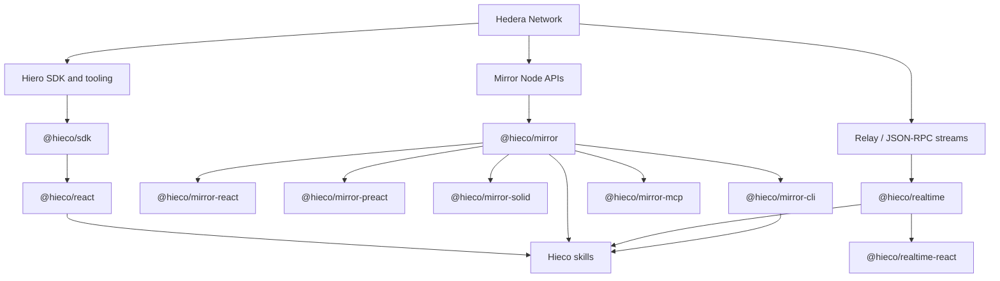

# Hieco

Hieco is a TypeScript-first ecosystem for building blockchain applications, with a strong focus on the Hedera network.

It brings together:

- a core application SDK for Hedera queries and transactions
- framework wrappers for React, Preact, and Solid
- typed Mirror Node clients and realtime relay clients
- a terminal CLI for Mirror Node reads
- an MCP server for Mirror services
- agent skills for the public package families

The goal is simple: make blockchain integrations feel like normal modern application development, with typed APIs, predictable runtime boundaries, and framework-native ergonomics.

## Overview

Hieco sits on top of the main developer surfaces around Hedera:

- the Hedera public network itself
- the Hiero developer stack and SDKs
- Hedera Mirror Node services
- Hedera relay and wallet tooling

Some Hieco packages are built directly on top of the [Hiero SDK](https://www.npmjs.com/package/@hiero-ledger/sdk), especially the transaction-focused packages such as [`@hieco/sdk`](./packages/sdk/README.md) and [`@hieco/react`](./packages/react/README.md).

Other Hieco packages talk directly to network-facing services instead of going through the Hiero SDK:

- [`@hieco/mirror`](./packages/mirror/README.md) and its framework wrappers use the Mirror Node REST API
- [`@hieco/realtime`](./packages/realtime/README.md) and [`@hieco/realtime-react`](./packages/realtime-react/README.md) use the Hedera relay WebSocket / JSON-RPC stream surface
- [`@hieco/mirror-mcp`](./packages/mirror-mcp/README.md) exposes Mirror data to AI agents through MCP

## What Is Hedera?

[Hedera](https://hedera.com) is a public distributed ledger network that provides services for:

- native tokenization
- consensus and messaging
- smart contracts
- account and transaction infrastructure for decentralized applications

Hieco is built to make those services easier to consume from application code.

## What Is Hiero?

[Hiero](https://hiero.org) is the open-source, vendor-neutral distributed ledger technology project used to build the Hedera public ledger.

For Hieco users, the practical meaning of Hiero is:

- it provides the official SDK foundation used by parts of Hieco
- it includes local-node and developer tooling around the Hedera ecosystem
- it is the lower-level developer stack that Hieco builds on when transaction execution or signer integration is needed

In short:

- Hedera is the network
- Hiero is the open-source developer and infrastructure stack behind that ecosystem
- Hieco is the higher-level application and framework toolkit built for developers who want a cleaner experience on top of those surfaces

## How The Ecosystem Fits Together



## Packages

### Core Application SDK

| Package                                      | Purpose                                                            | Best for                                                                |
| -------------------------------------------- | ------------------------------------------------------------------ | ----------------------------------------------------------------------- |
| [`@hieco/sdk`](./packages/sdk/README.md)     | Core Hedera application SDK with typed query and transaction APIs. | Server code, signer-driven browser flows, and general Hedera app logic. |
| [`@hieco/react`](./packages/react/README.md) | React wrapper for the core SDK with TanStack Query.                | React apps that need Hedera reads, writes, and wallet-aware hooks.      |

### Mirror SDK Family

| Package                                                      | Purpose                                              | Best for                                                      |
| ------------------------------------------------------------ | ---------------------------------------------------- | ------------------------------------------------------------- |
| [`@hieco/mirror`](./packages/mirror/README.md)               | Typed client for Hedera Mirror Node REST APIs.       | Read-only data access, scripts, services, and tooling.        |
| [`@hieco/mirror-react`](./packages/mirror-react/README.md)   | React hooks for Mirror reads with TanStack Query.    | React dashboards, explorers, and read-heavy applications.     |
| [`@hieco/mirror-preact`](./packages/mirror-preact/README.md) | Preact hooks for Mirror reads with TanStack Query.   | Preact applications that need Mirror data.                    |
| [`@hieco/mirror-solid`](./packages/mirror-solid/README.md)   | Solid bindings for Mirror reads with TanStack Query. | Solid applications with reactive Mirror queries.              |
| [`@hieco/mirror-cli`](./packages/mirror-cli/README.md)       | Command-line interface for Mirror Node data.         | Terminal inspection, debugging, scripting, and ops workflows. |
| [`@hieco/mirror-mcp`](./packages/mirror-mcp/README.md)       | MCP server for Mirror Node data.                     | AI agents, MCP-compatible tools, and local data assistants.   |

### Realtime SDK Family

| Package                                                        | Purpose                                    | Best for                                                           |
| -------------------------------------------------------------- | ------------------------------------------ | ------------------------------------------------------------------ |
| [`@hieco/realtime`](./packages/realtime/README.md)             | WebSocket client for Hedera relay streams. | Live subscriptions, relay events, and JSON-RPC stream consumption. |
| [`@hieco/realtime-react`](./packages/realtime-react/README.md) | React bindings for realtime streams.       | React apps with live Hedera or relay-backed UI updates.            |

### Internal Shared Package

| Package                                      | Purpose                                                      |
| -------------------------------------------- | ------------------------------------------------------------ |
| [`@hieco/utils`](./packages/utils/README.md) | Internal shared types and helpers used across the workspace. |

## Choose A Starting Point

If you are building:

- a general Hedera app with transactions or wallet flows, start with [`@hieco/sdk`](./packages/sdk/README.md)
- a React app that needs Hedera reads and writes, start with [`@hieco/react`](./packages/react/README.md)
- a read-only app against Mirror Node APIs, start with [`@hieco/mirror`](./packages/mirror/README.md) or one of its framework wrappers
- a terminal workflow, start with [`@hieco/mirror-cli`](./packages/mirror-cli/README.md)
- an AI or agent workflow over Mirror data, start with [`@hieco/mirror-mcp`](./packages/mirror-mcp/README.md)
- a live stream or subscription workflow, start with [`@hieco/realtime`](./packages/realtime/README.md)

## MCP Server

Hieco includes a dedicated MCP server for Mirror services:

- [`@hieco/mirror-mcp`](./packages/mirror-mcp/README.md)

It exposes Mirror Node data to MCP-compatible clients and AI agents over stdio, including:

- accounts
- tokens
- transactions
- blocks
- contracts
- schedules
- topics
- network status and runtime network switching

If you want AI tooling to query Hedera Mirror data without writing your own wrappers, this is the entry point.

## Agent Skills

Hieco also ships a set of agent skills that cover the public package families:

- Hieco SDK + React
- Hieco Mirror SDK family
- Hieco Realtime SDK family
- Hieco Mirror CLI

These skills are intended for AI coding agents and local agent tooling, with offline reference files for installation, best practices, package selection, and API reference.

### Install The Skills With Flins

Using [flins](https://flins.tech/), install the Hieco skill collection from this repository:

```bash
npx flins add powxenv/hieco
```

```bash
bunx flins add powxenv/hieco
```

Useful links:

- [flins website](https://flins.tech/)
- [flins GitHub repository](https://github.com/flinstech/flins)

## Documentation

Each package README is written as the canonical package guide:

- [`@hieco/sdk`](./packages/sdk/README.md)
- [`@hieco/react`](./packages/react/README.md)
- [`@hieco/mirror`](./packages/mirror/README.md)
- [`@hieco/mirror-react`](./packages/mirror-react/README.md)
- [`@hieco/mirror-preact`](./packages/mirror-preact/README.md)
- [`@hieco/mirror-solid`](./packages/mirror-solid/README.md)
- [`@hieco/mirror-cli`](./packages/mirror-cli/README.md)
- [`@hieco/mirror-mcp`](./packages/mirror-mcp/README.md)
- [`@hieco/realtime`](./packages/realtime/README.md)
- [`@hieco/realtime-react`](./packages/realtime-react/README.md)

## Development

Install dependencies:

```bash
bun install
```

Run the full quality suite:

```bash
bun run lint && bun run typecheck && bun run fmt
```

Build all public packages:

```bash
bun run build
```

See [CONTRIBUTING.md](./CONTRIBUTING.md) for repository workflows.

## Repository

- GitHub: [powxenv/hieco](https://github.com/powxenv/hieco)
- Issues: [github.com/powxenv/hieco/issues](https://github.com/powxenv/hieco/issues)

## License

MIT
